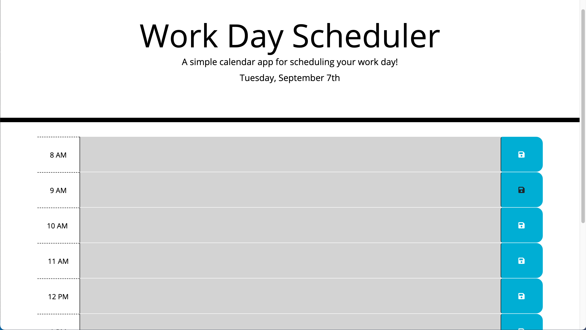
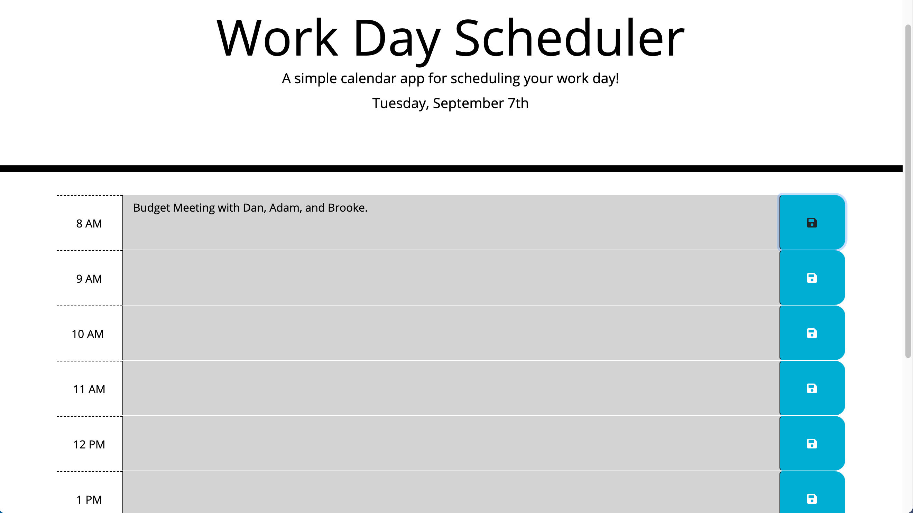
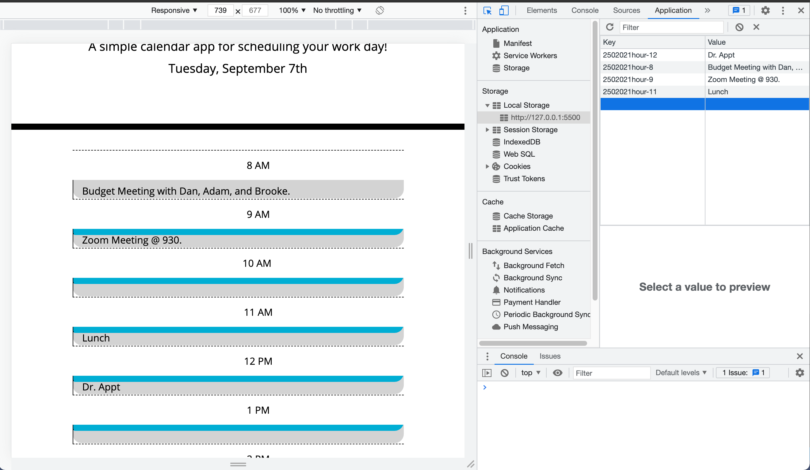

# Work Day Scheduler

## User can open planner and the current day will display with hours from 8am to 5pm.
## While user views planner - past, present, and future time slots will be color coded.
## User can click on a timeslot and and add an event that will save to the local storage.
## User will see saved event will persist for the day.

 
 
 

# Link to Launch Website
[Click Me!](https://brittnc.github.io/planner/)

 
 
 

# Screenshot of Live Webpage

 
 

 
 

